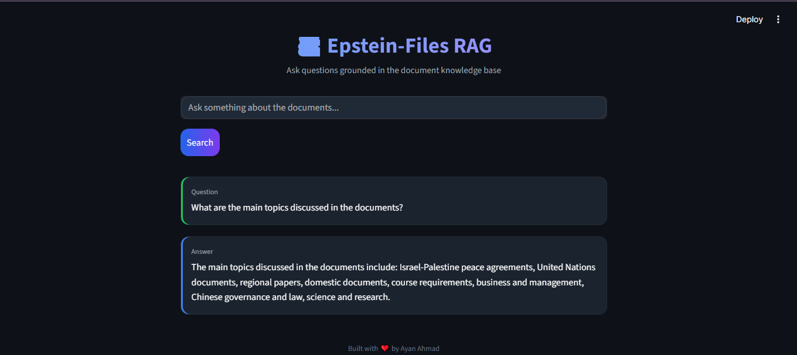

# EpsteinFiles-RAG

A **Retrieval-Augmented Generation (RAG) pipeline** built on the **Epstein Files 20K dataset** from Hugging Face.

This system processes millions of document lines, converts them into embeddings, and retrieves relevant context to generate **accurate answers grounded in source documents**.

---

## Dataset Source

👉 https://huggingface.co/datasets/teyler/epstein-files-20k

---

# ⚡ Quick Demo

Process **2M+ document lines → Get grounded answers in seconds**

### What the system does

- Downloads dataset from Hugging Face
- Cleans and reconstructs fragmented documents
- Splits documents into semantic chunks
- Generates embeddings for each chunk
- Stores vectors for similarity search
- Retrieves relevant context using **MMR**
- Generates answers using **LLMs**

---
## 📸 Application Demo

Below is the Streamlit interface used to query the document knowledge base.




# 🎯 Key Features

- **No Hallucinations** – Answers strictly from retrieved documents  
- **MMR Retrieval** – Ensures diverse contextual results  
- **Fast Queries** – ~1 second response time  
- **Context-Aware Chunking** – Maintains document structure  
- **Modular Pipeline** – Separate ingestion, splitting, embedding  
- **Streamlit UI** – Interactive interface for queries  
- **Scalable** – Handles large datasets  

---


## 🏗️ How It Works

### Three Simple Stages

**Stage 1: Data Preparation**
```
Raw Dataset
↓
Download
↓
Cleaning & Reconstruction
↓
Document Chunking
↓
Vector Embeddings
```

**Stage 2: Intelligent Retrieval**
```
User Question
↓
Vector Similarity Search
↓
MMR Reranking
↓
Top Relevant Chunks
```

**Stage 3: Grounded Answer**
```
Retrieved Context + User Question
↓
LLM (Groq)
↓
Grounded Answer
```

### Why MMR Instead of Similarity?

**Previous Approach:** Pure semantic similarity  
→ Returned redundant chunks from same document

**Current Approach:** Maximal Marginal Relevance (MMR)  
→ Balances relevance + diversity for comprehensive context

---

## 📦 Installation

### Requirements
- Python 3.11+
- 16GB RAM (8GB minimum)
- Groq API key (free at [console.groq.com](https://console.groq.com))

### Setup (5 minutes)

**1. Clone repository**
```bash
git clone https://github.com/ayanahmad04/Epstein-Files-RAG.git
cd EpsteinFiles-RAG
```

**2. Create virtual environment**
```bash
python -m venv venv
source venv/bin/activate  # Windows: venv\Scripts\activate
```

**3. Install dependencies**
```bash
pip install -r requirements.txt
```

**4. Configure environment**

Create `.env` file:
```
GROQ_API_KEY=your_api_key_here
```

## 🚀 Getting Started

### Run Complete Pipeline (First Time)

This processes data and prepares the system for queries:

```bash

python pipeline.py

```
This will:

Download dataset

Clean documents

Chunk them

Generate embeddings

Store vectors

### Start Using the System

**Terminal 1 - Start API Server**
```bash
uvicorn api.main:app --reload
```
API runs at: `http://127.0.0.1:8000`

**Terminal 2 - Start Web UI**
```bash
streamlit run app.py
```
UI opens at: `http://localhost:8501`

**That's it!** You can now query through the web interface or API.

---
## 📚 Project Structure

```
EpsteinFiles-RAG
│
├── ingestion
│   ├── download.py        # Download dataset from Hugging Face
│   └── clean.py           # Clean and reconstruct documents
│
├── splitter
│   └── chunk.py           # Semantic document chunking
│
├── embed
│   └── embedding.py       # Generate embeddings and store vectors
│
├── pipeline.py            # End-to-end pipeline runner
├── main.py                # Retrieval logic
├── app.py                 # Streamlit web interface
│
├── requirements.txt
└── README.md
```

---

## 📜 License

This project is licensed under the **MIT License** - see the [LICENSE](LICENSE) file for details.

---

## 🙏 Acknowledgments

- **Dataset:** [Teyler/Epstein Files 20K](https://huggingface.co/datasets/teyler/epstein-files-20k) on Hugging Face
- **Embeddings:** [Sentence Transformers](https://www.sbert.net/)
- **Vector DB:** [Chroma](https://www.trychroma.com/)
- **LLM Inference:** [Groq Cloud](https://console.groq.com/)
- **Framework:** [LangChain](https://www.langchain.com/)
- **UI:** [Streamlit](https://streamlit.io/)

---

## 📞 Support

**Built by:** Ayan Ahmad 
**AI Engineer**

**Get Help:**
- 📝 [Open an Issue](https://github.com/ayanahmad04/Epstein-Files-RAG/issues)
- 💬 [Start a Discussion](https://github.com/ayanahmad04/Epstein-Files-RAG/discussions)

---

## ⚠️ Disclaimer

This project is built for **research, transparency, and educational purposes**. All data is sourced from public records. Users are responsible for complying with applicable laws and ethical guidelines when using this system.

---
